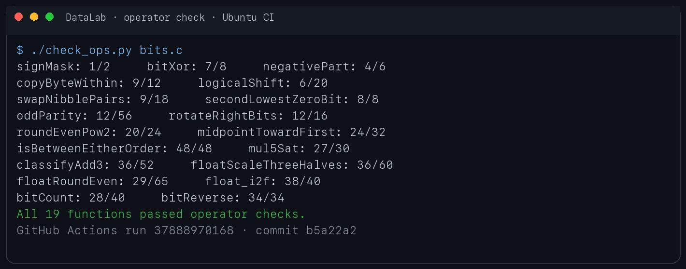
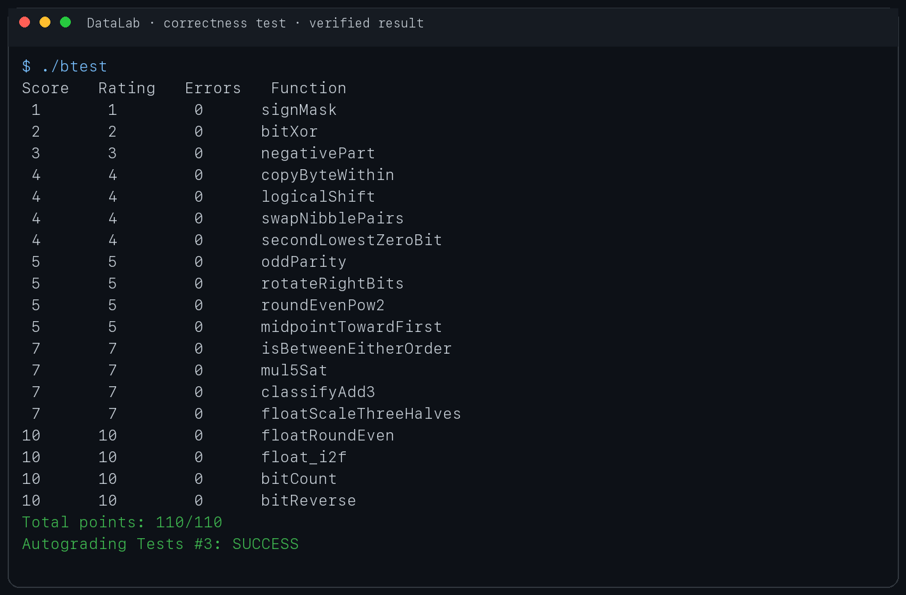

# Lab1：Data Lab 实验报告

- 仓库：[https://github.com/RuoyiXu/DataLab](https://github.com/RuoyiXu/DataLab)
- 最终提交：`b5a22a2`

## 一、实验目的

本实验通过限制可使用的 C 语言运算符，练习 32 位补码、位运算、移位、整数溢出、IEEE 754 单精度浮点数编码以及向最近偶数舍入。实验共完成 P1–P19，并使用课程提供的规则检查器和正确性测试验证实现。

## 二、实验环境与验证结果

- 本地环境：macOS，使用 32 位 `int` 语义和 `-fwrapv` 兼容选项完成正确性测试。
- 正式环境：GitHub Actions 的 Ubuntu 课程评测环境。
- 运算符检查：19 个函数全部通过，每题均未超过最大操作数。
- 正确性测试：19 个函数的 `Errors` 均为 0，总分 `110/110`。
- 最终 Workflow：[Autograding Tests #3](https://github.com/RuoyiXu/DataLab/actions/runs/37888970168)

### 1. 运算符与操作数检查

## 三、各题实现思路

### P1 `signMask`

将常数 `1` 左移 31 位，得到只有最高位为 1 的掩码 `0x80000000`。

### P2 `bitXor`

利用德摩根律表示异或：排除“两个对应位同时为 1”和“两个对应位同时为 0”两种情况，全程只使用 `~` 与 `&`。

### P3 `negativePart`

通过算术右移取得全 0 或全 1 的符号掩码，再将 `-x` 的补码形式 `~x + 1` 与该掩码相与。非负数返回 0，负数返回相反数的位模式。

### P4 `copyByteWithin`

把源字节右移到最低 8 位并用 `0xff` 取出；构造目标字节位置的掩码，先清空目标字节，再把源字节左移到目标位置并合并。

### P5 `logicalShift`

C 的有符号右移会补符号位，因此根据移位量构造低位全 1 的掩码，将算术右移结果的高位符号扩展清零，从而得到逻辑右移。

### P6 `swapNibblePairs`

构造重复的 `0x0f` 掩码，分别取出每个字节的低半字节和高半字节，向相反方向移动 4 位后合并。

### P7 `secondLowestZeroBit`

先对输入取反，使原来的 0 位变成 1。使用 `x & (-x)` 提取最低 1 位，删除该位后再执行一次相同操作，即得到第二低的原零位；不存在时结果自然为 0。

### P8 `oddParity`

依次将 32、16、8、4、2、1 位范围内的奇偶性通过异或折叠到最低位。最低位为 0 表示原数中 1 的个数为偶数，按题意取反后返回 1。

### P9 `rotateRightBits`

先用 `n & 31` 将旋转量限制到 0–31。结果由逻辑右移部分和左移回卷部分合并；左移量使用 `(-n) & 31`，因此也正确处理旋转量为 0 或 32 的倍数。

### P10 `roundEvenPow2`

把 `x` 分成除以 `2^n` 的商和余数。余数大于一半时进位，小于一半时舍去；恰好一半时检查商的最低位，只在商为奇数时进位，从而实现 ties-to-even。

### P11 `midpointTowardFirst`

使用 `(x & y) + ((x ^ y) >> 1)` 无溢出地得到向下取整的中点。若两数和为奇数且第一个参数大于第二个参数，则加 1，使中点朝第一个参数方向取整。

### P12 `isBetweenEitherOrder`

分别判断 `a <= x <= b` 和 `b <= x <= a`。比较时先处理符号不同的情况，符号相同时再利用补码差值的符号判断大小，避免普通减法溢出导致误判。

### P13 `mul5Sat`

用 `x + (x << 2)` 计算五倍值。构造 `INT_MAX / 5` 的边界并判断正、负方向是否溢出；溢出时根据输入符号选择 `INT_MAX` 或 `INT_MIN`，否则返回乘积。

### P14 `classifyAdd3`

先计算 `x + y`，再加 `z`，分别记录两次加法的正溢出和负溢出。如果两次溢出方向相反，它们会在精确数学和中抵消；否则根据最终保留的溢出方向返回 1、-1 或 0。

### P15 `floatScaleThreeHalves`

分离符号、阶码和尾数；NaN 与无穷直接返回。把有效数乘 3 后按需要右移 1 位或 2 位，并根据余数实现向最近偶数舍入，同时处理非规格化数转为规格化数以及结果溢出到无穷的情况。

### P16 `floatRoundEven`

根据阶码判断小于 0.5、位于 `[0.5, 1)`、已有整数精度以及仍含小数位的情况。对仍含小数位的数清除尾部位，并依据被删除部分与半程值的关系执行 ties-to-even；舍入到零时保留原符号。

### P17 `float_i2f`

先记录符号并取得绝对值，再定位最高有效位来确定阶码。有效位不超过 24 位时直接对齐；否则保留最高 24 位，并根据被舍弃部分执行向最近偶数舍入，同时处理尾数进位导致阶码增加。

### P18 `bitCount`

使用分治并行计数：先统计每 2 位中的 1，再逐步合并为每 4、8、16、32 位的计数。掩码分别由 `0x55`、`0x33` 和 `0x0f` 扩展得到，最终低 6 位即为答案。

### P19 `bitReverse`

采用分治交换。先交换高低 16 位，再依次交换每组中的 8、4、2、1 位。掩码从 `0x0000ffff` 开始逐级异或移位生成，使实现正好使用 34 个操作，满足题目上限。

## 四、边界情况

实现和测试中特别检查了以下情况：

- `0`、`-1`、`INT_MIN`、`INT_MAX`；
- 移位或旋转量为 0、1、31 以及 32 的倍数；
- 正负方向的整数溢出与三数相加时的溢出抵消；
- 浮点数的 `+0`、`-0`、非规格化数、最小规格化数、最大有限数、无穷和 NaN；
- 小于半程、恰好半程和大于半程的舍入，其中半程情况按偶数舍入。

## 五、实验总结

本实验让我更直观地理解了补码、算术右移和逻辑右移之间的区别，也体会到整数溢出不能只依赖一次符号判断。浮点题的难点主要是规格化边界和 ties-to-even：既要判断被舍弃位是否超过半程，也要在恰好半程时检查保留结果的奇偶性。最后通过分治复用掩码，将 `bitReverse` 的操作数从 35 次压缩到规定的 34 次，并在课程自动评测中取得 `110/110`。

## 六、参考资料

- 课程实验说明：[Lab1：DataLab](https://ics-26fall-fdu.github.io/labs/lab1-data-lab/)
- Randal E. Bryant、David R. O'Hallaron，《深入理解计算机系统》第 2 章。
- 本实验实现过程中使用 AI 辅助梳理位运算、边界条件和报告文字；所有代码均经过课程提供的规则检查器与自动测试验证。
